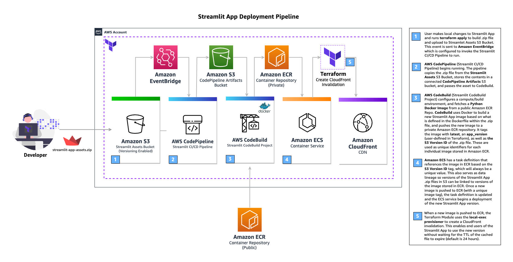

# AWS Serverless Streamlit App Terraform Module

## Features

- Serverless deployment using ECS, Application Load Balancer, and CloudFront
- Ability to reference existing VPCs, Subnets, Security Groups, and IAM Roles/Policies
- Automated build of Docker Images
- Automated push of Docker Images to Amazon Elastic Container Registry (ECR)
- Configurable automated CloudFront Invalidations
- Dynamic rollback to previous app versions via image tag

## Architecture

### Streamlit App Hosting


### Streamlit App Deployment Pipeline



## Basic Usage - Simple deployment of sample Streamlit app with default configuration

### Important

**Note:** The basic deployment will create necessary networking and security services for you with the default values defined in the module variables. If you need to reference existing security and networking resources (VPCs, Subnets, Security Groups, IAM Roles/Policies), please visit review the example for existing resources in the `examples` directory.

**Note**: Ensure the architecture of your ECS Task matches your CodeBuild project. For example, if your CodeBuild project uses an ARM environment such as `BUILD_GENERAL1_SMALL` and an ARM image such as `aws/codebuild/amazonlinux2-aarch64-standard:3.0`, you must also set the architecture of your ECS task to be `ARM64`.

The module provides variables named `ecs_cpu_architecture` `codebuild_compute_type`, and `codebuild_image` which can be modified to your desired values. The default values are using ARM.

**Relevant docs**:

- [CodeBuild - Docker images provided by CodeBuild](https://docs.aws.amazon.com/codebuild/latest/userguide/build-env-ref-available.html)
- [CodeBuild - Build environment compute modes and types](https://docs.aws.amazon.com/codebuild/latest/userguide/build-env-ref-compute-types.html)

```hcl
// This is a template file for a basic deployment.
// Modify the parameters below with your desired values

module "serverless-streamlit-app" {
  source = "aws-ia/serverless-streamlit-app/aws"

  app_name    = "streamlit-app"
  environment = "dev"
  app_version = "v0.0.1" # used as one of the tags for Docker image. Update this when you wish to push new changes to ECR.
}
```

## Contributing

See the `CONTRIBUTING.md` file for information on how to contribute.
